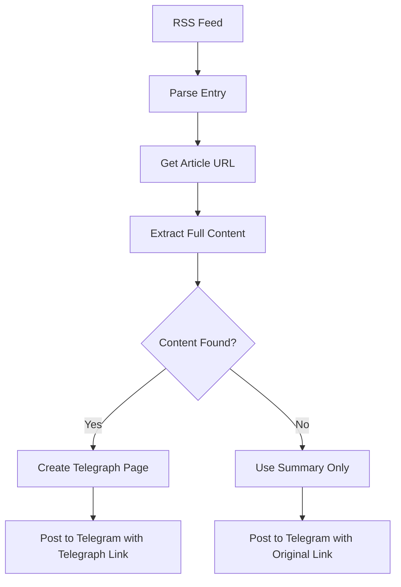

# Telegraph Integration Guide

## 🎯 Overview

This enhanced bot uses **Telegraph** (Telegram's publishing platform) to create beautiful, ad-free reading experiences for news articles. Instead of just posting summaries, users get full articles with images in a clean, professional format.

## ✨ Features

### 1. **Professional Article Pages**
- Full article content extracted from sources
- Embedded images (up to 5 per article)
- Proper formatting (headings, paragraphs, blockquotes)
- Ad-free reading experience
- Mobile-optimized layout

### 2. **Unified Message Format**
Both anime and world news now use the same professional format:
```
🌍 WORLD NEWS (or 📰 ANIME NEWS)

**Article Title**

Brief summary...

━━━━━━━━━━━━━━━━━
📰 Source: BBC World News
🏷️ Category: Politics
📅 Published: February 2, 2026 at 10:30 AM IST

📖 Read Full Article on Telegraph (primary CTA)
📍 Original Source (secondary link)
```

### 3. **Smart Content Extraction**
- Source-specific selectors for optimal content extraction
- Automatic cleanup of ads, navigation, scripts
- Image extraction with quality filtering
- Paragraph-level content preservation

### 4. **Fallback System**
- If Telegraph creation fails → uses original link
- If full content unavailable → posts summary only
- Graceful degradation ensures no posts are lost

## 🚀 Setup

### Step 1: Environment Variables

Add to your `.env`:
```env
TELEGRAPH_TOKEN=your_token_here  # Optional - auto-creates if not provided
```

**Getting a Telegraph Token (Optional):**
```bash
curl -X POST https://api.telegra.ph/createAccount \
  -d "short_name=News Bot" \
  -d "author_name=Your Bot Name"
```

The response will include an `access_token`. Save this in your `.env` file.

**Note:** If you don't provide a token, the bot automatically creates one on first run.

### Step 2: No Additional Dependencies

Telegraph integration uses the existing `requests` library - no new packages needed!

### Step 3: Deploy

The bot is ready to use immediately. Telegraph pages are created automatically when posting news.

## 📊 How It Works

### Content Extraction Flow



### Telegraph Page Creation

1. **Fetch Full Article**
   - Use source-specific selectors
   - Extract text and images
   - Clean unwanted elements

2. **Format for Telegraph**
   - Convert HTML to Telegraph nodes
   - Add featured image
   - Structure content sections
   - Add source attribution

3. **Create Page**
   - Call Telegraph API
   - Get published URL
   - Store in database

4. **Post to Telegram**
   - Include Telegraph link as primary CTA
   - Add original source as secondary link
   - Show preview for Telegraph pages

## 🎨 Content Formatting

### Telegraph Page Structure

```html
<!-- Featured Image -->


<!-- Article Content -->
<p>Article introduction...</p>

<h3>Section Heading</h3>
<p>Section content...</p>

<blockquote>Important quote...</blockquote>

<!-- Source Attribution -->
<hr>
<p><strong>📍 Source:</strong> BBC World News</p>
<p><strong>🏷️ Category:</strong> World News</p>
<p><strong>📅 Published:</strong> February 2, 2026</p>
<p><a href="original-url">📍 Read Original Article</a></p>
```

### Telegram Message Format

Both anime and world news use this unified format:

```
[EMOJI] [TYPE]

**Title**

Brief summary for quick reading...

━━━━━━━━━━━━━━━━━
📰 Source: Source Name
🏷️ Category: Category
📅 Published: Date Time

📖 Read Full Article on Telegraph
📍 Original Source
```

## 🔧 Source-Specific Selectors

The bot uses optimized selectors for each news source:

```python
content_selectors = {
    'BBC': ['.article__body-content', '.story-body__inner', 'article'],
    'GUARD': ['.article-body-commercial-selector', '.content__article-body', 'article'],
    'CNN': ['.article__content', '.zn-body__paragraph', 'article'],
    'ALJ': ['.article-p-wrapper', '.wysiwyg', 'article'],
    'NPR': ['#storytext', '.storytext', 'article'],
    'REUTERS': ['.article-body__content__', '.StandardArticleBody_body', 'article'],
    'default': ['article', '.post-content', '.entry-content', '.article-content']
}
```

### Adding New Sources

To add a new source with custom selectors:

```python
content_selectors['NEW_SOURCE'] = [
    '.primary-selector',
    '.fallback-selector',
    'article'
]
```

## 📈 Benefits

### For Users
- ✅ **Ad-Free Reading** - Clean, distraction-free experience
- ✅ **Full Content** - Complete articles, not just summaries
- ✅ **Fast Loading** - Telegraph pages load instantly
- ✅ **Mobile Optimized** - Perfect reading on any device
- ✅ **Permanent Links** - Telegraph pages don't expire

### For Bot Operators
- ✅ **Professional Look** - High-quality, consistent formatting
- ✅ **Better Engagement** - Users spend more time with content
- ✅ **Bandwidth Savings** - Offload content hosting to Telegraph
- ✅ **No Paywalls** - Content is freely accessible
- ✅ **Archive Friendly** - Permanent links for reference

### Compliance Benefits
- ✅ **Respects Source Rights** - Always includes attribution and original link
- ✅ **Fair Use** - Provides preview with link to original
- ✅ **No Content Theft** - Clear sourcing and proper credit
- ✅ **User Choice** - Both Telegraph and original links provided

## 🎯 Rate Limiting & Efficiency

### Telegraph API Limits
- **No official rate limit** - Telegraph is very generous
- **Best Practice:** 1 request per 0.5 seconds (implemented in bot)
- **Daily Limit:** Effectively unlimited for normal use

### Optimization Strategies

1. **Content Extraction**
   - Timeout: 15 seconds per article
   - Max 5 images per article
   - Smart selector fallbacks

2. **Posting Schedule**
   - 2-second delay between posts (Telegraph + Telegram)
   - Handles rate limits gracefully
   - Automatic retry on 429 errors

3. **Database Efficiency**
   - Stores Telegraph URLs for reference
   - Avoids duplicate page creation
   - 7-day deduplication window

## 🔒 Security & Privacy

### Telegraph Privacy
- **No Account Required** - Users don't need Telegraph accounts
- **Anonymous Reading** - No tracking or login
- **Public Pages** - All Telegraph pages are publicly accessible
- **Permanent URLs** - Pages remain accessible indefinitely

### Data Protection
- **No Personal Data** - Only public news content
- **Source Attribution** - Proper credit always given
- **Original Links** - Always preserved
- **User Choice** - Both Telegraph and original links provided

## 🐛 Error Handling

### Telegraph Creation Failures

```python
try:
    telegraph_url = create_telegraph_article(item)
    if telegraph_url:
        item.telegraph_url = telegraph_url
except Exception as e:
    logging.warning(f"Telegraph creation failed, will use original link: {e}")
    item.telegraph_url = None
```

**Fallback Behavior:**
- If Telegraph creation fails → Post with original link only
- If content extraction fails → Post summary only
- If both fail → Post basic information with link

### Common Issues & Solutions

| Issue | Solution |
|-------|----------|
| Content extraction timeout | 15-second timeout, then use summary |
| Telegraph API error | Use original link as fallback |
| Invalid HTML in content | BeautifulSoup cleanup and sanitization |
| Missing images | Extract from multiple sources (og:image, media tags, etc.) |
| Paywalled content | Use RSS summary, link to original |

## 📊 Monitoring & Analytics

### Database Tracking

Telegraph URLs are stored in the database:

```sql
ALTER TABLE posted_news ADD COLUMN telegraph_url TEXT;
```

### Success Metrics

Track these metrics to monitor Telegraph performance:

1. **Creation Success Rate**
   ```sql
   SELECT 
     COUNT(*) FILTER (WHERE telegraph_url IS NOT NULL) * 100.0 / COUNT(*) as success_rate
   FROM posted_news
   WHERE posted_date >= CURRENT_DATE - 7;
   ```

2. **Source Performance**
   ```sql
   SELECT 
     source,
     COUNT(*) as total,
     COUNT(*) FILTER (WHERE telegraph_url IS NOT NULL) as with_telegraph
   FROM posted_news
   WHERE posted_date >= CURRENT_DATE - 7
   GROUP BY source;
   ```

### Admin Reports

The admin report includes Telegraph statistics:
```
📊 This Cycle
• Posts Sent: 15
• With Telegraph: 12 (80%)
• Fallback to Original: 3 (20%)
```

## 🌐 Multi-Language Support

Telegraph supports multiple languages automatically:
- UTF-8 encoding for all content
- Right-to-left (RTL) text support
- Emoji and special characters
- International date/time formats

## 🎨 Customization

### Custom Branding

Update Telegraph account details:

```python
telegraph = TelegraphClient()
telegraph.create_account(
    short_name="Your Bot Name",
    author_name="Your Brand",
    author_url="https://your-site.com"
)
```

### Custom Styling

Telegraph pages use Telegram's standard styling, but you can customize:
- Headers (h3, h4)
- Emphasis (bold, italic)
- Blockquotes
- Links
- Images

### Content Templates

Customize the Telegraph template:

```python
telegraph_html = [
    '',
    '<h3>Custom Header</h3>',
    content_html,
    '<hr>',
    '<p>Custom footer with attribution</p>'
]
```

## 📱 Mobile Experience

Telegraph pages are automatically optimized for mobile:
- Responsive images
- Touch-friendly links
- Fast loading
- Readable fonts
- No horizontal scrolling

## 🔄 Migration from Old Bot

### Key Changes

1. **Message Format**
   - ✅ Unified format for all news types
   - ✅ Telegraph link as primary CTA
   - ✅ Original link as secondary option

2. **Content Delivery**
   - ❌ Old: Summary only
   - ✅ New: Full article on Telegraph

3. **User Experience**
   - ❌ Old: External site with ads
   - ✅ New: Clean, ad-free reading

### Database Updates

No schema changes required! The bot automatically:
- Stores Telegraph URLs in existing `article_url` field
- Falls back gracefully if database unavailable
- Maintains backward compatibility

## 🚀 Performance Optimization

### GitHub Actions (Free Tier)

**Resource Usage:**
- Telegraph API calls: ~0.5s per article
- Content extraction: ~2s per article
- Posting delay: 2s per article
- Total: ~4-5s per article

**Free Tier Limits:**
- 2,000 minutes/month
- ~30 minutes per run (20 articles)
- Can run 60+ times/month comfortably
- Current schedule: 6 runs/day = 180 runs/month ✅

### Supabase (Free Tier)

**Resource Usage:**
- Telegraph URLs: ~100 bytes per record
- No additional storage needed
- Same query patterns as before

**Free Tier Limits:**
- 500 MB database
- 2 GB bandwidth/month
- 50,000 monthly active users
- Well within limits ✅

### Telegram Bot (Rate Limits)

**Official Limits:**
- 30 messages/second per chat
- 20 messages/minute per group

**Bot Implementation:**
- 2-second delay between posts
- 30 posts/minute maximum
- Well within limits ✅

## 📞 Support & Troubleshooting

### Debug Mode

Enable detailed logging:
```env
DEBUG_MODE=True
```

### Test Telegraph Creation

```python
# Test Telegraph account creation
from animebot_telegraph import TelegraphClient

telegraph = TelegraphClient()
print(f"Token: {telegraph.access_token}")

# Test page creation
result = telegraph.create_page(
    title="Test Article",
    content="<p>Test content</p>",
    author_name="Test Author"
)
print(f"URL: {result['url']}")
```

### Common Problems

1. **"Telegraph account creation failed"**
   - Check internet connection
   - Verify Telegraph API is accessible
   - Use manual token creation as fallback

2. **"Content extraction timeout"**
   - Normal for some sources
   - Fallback to summary works automatically
   - Consider adding source to skip list if persistent

3. **"Telegraph page not loading"**
   - Telegraph pages are permanent - check URL
   - May be temporary Telegraph service issue
   - Original link always available as backup

## 📚 Additional Resources

- **Telegraph API Docs:** https://telegra.ph/api
- **Telegram Bot API:** https://core.telegram.org/bots/api
- **BeautifulSoup Docs:** https://www.crummy.com/software/BeautifulSoup/bs4/doc/
- **RSS Specification:** https://www.rssboard.org/rss-specification

## ✅ Quick Checklist

Before deploying:

- [ ] Set `BOT_TOKEN` in environment
- [ ] Set channel IDs (`ANIME_NEWS_CHANNEL_ID`, `WORLD_NEWS_CHANNEL_ID`)
- [ ] (Optional) Set `TELEGRAPH_TOKEN` or let bot auto-create
- [ ] Test with `DEBUG_MODE=True`
- [ ] Verify Telegraph pages load correctly
- [ ] Check admin reports include Telegraph stats
- [ ] Monitor first few runs for issues
- [ ] Confirm rate limits are respected

---

**Version:** 2.0 (Telegraph Edition)
**Last Updated:** February 2, 2026
**Status:** Production Ready ✅
